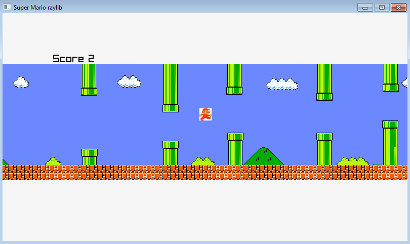

## In class raylib mini Game Jam Submission
Mario Bird

## My Implementation

## How to play
Play with Sound!

Play with left mouse button.

Get to the goal without touching the sky, ground, pipe, and bricks

Special Thanks to:

Nintento for creating Mario

Google Images for mario various images

https://downloads.khinsider.com/game-soundtracks/album/super-mario-bros for mario sounds
